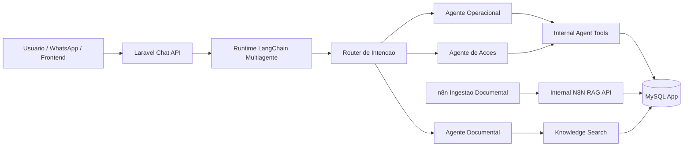

# Arquitetura do Chatbot: LangChain + MySQL + RAG Documental

Atualizado em 2026-03-20.

## Decisao arquitetural

Para o MedIntelligence, o LangChain deve consumir o banco da aplicacao e os endpoints internos do Laravel para dados operacionais.

Resumo pratico:

- MySQL da aplicacao e a fonte de verdade para clientes, faturas, titulos, despesas, cobrancas, dashboard e configuracoes.
- LangChain deve usar tools autenticadas do Laravel para consultar e executar acoes de negocio.
- RAG continua fazendo sentido para conhecimento nao estruturado, como manuais, FAQs, procedimentos internos, playbooks financeiros e regras operacionais.
- O vector database deixa de ser obrigatorio nesta fase. Os documentos RAG passam a ser ingeridos em MySQL nas tabelas `rag_documents` e `rag_chunks`.
- Se no futuro houver necessidade de busca semantica de maior escala, um vector store pode ser reintroduzido como cache de recuperacao, nunca como fonte primaria dos dados transacionais.

## Por que MySQL faz mais sentido para o runtime

Porque o chatbot precisa:

- consultar estado atual do negocio;
- executar criacao de cliente, conta a receber e conta a pagar;
- respeitar autorizacao por usuario;
- exigir confirmacao para operacoes sensiveis;
- responder com dados consistentes com o sistema operacional.

Esses requisitos dependem de:

- leitura transacional;
- regras de dominio;
- trilha de auditoria;
- contratos de API estaveis.

Vector database nao resolve isso. Ele serve para recuperar contexto textual, nao para substituir o modelo transacional.

## Arquitetura alvo

Implementacao desta iteracao:

- runtime Python em `agent-runtime/`;
- `FastAPI` para os endpoints de runtime;
- `LangChain` para roteamento multiagente, planejamento de acao e agentes especialistas;
- confirmacao de escrita via `POST /chat/resume`;
- `docker-compose.yml` atualizado com o servico `langchain-runtime`.

## Modelo multiagente adotado

O chatbot agora deve ser entendido como um orquestrador com tres papeis:

- `Router`: interpreta a intencao em linguagem natural e decide se a entrada e consulta operacional, consulta documental, acao operacional ou ambigua;
- `Agente Operacional`: responde perguntas sobre clientes, faturas, titulos, despesas, fornecedores e indicadores financeiros usando tools do Laravel;
- `Agente Documental`: consulta o RAG quando a pergunta depender de manuais, politicas, procedimentos e planilhas/PDFs indexados;
- `Agente de Acoes`: prepara payloads estruturados para operacoes sensiveis, exige confirmacao e executa via tools internas.

Isso reduz a dependencia de frases predefinidas. O sistema deixa de depender de `if usuario falou X` e passa a decidir a partir da intencao.

Ponto importante:

- isso elimina a necessidade de codificar cada forma de perguntar;
- mas nao elimina a necessidade de modelar as capacidades de escrita do sistema.

Ou seja:

- novas variacoes linguisticas passam a ser absorvidas pela IA;
- novas operacoes de negocio ainda exigem tool, contrato e regra de autorizacao.

## Contratos internos implementados

### Autenticacao do runtime

Header obrigatorio:

- `X-Agent-Secret`
- `X-Agent-User-Id`

Middleware:

- `agent.runtime`

Rotas internas:

- `POST /api/internal/agent/session-context`
- `POST /api/internal/agent/knowledge/search`
- `GET /api/internal/agent/financial-summary`
- `POST /api/internal/agent/faturamento/summary`
- `POST /api/internal/agent/caixa/previsao`
- `POST /api/internal/agent/fechamento/diario`
- `POST /api/internal/agent/clientes/search`
- `POST /api/internal/agent/clientes/status`
- `POST /api/internal/agent/clientes/upsert`
- `POST /api/internal/agent/cobrancas/inadimplentes`
- `POST /api/internal/agent/cobrancas/registrar`
- `POST /api/internal/agent/titulos/search`
- `POST /api/internal/agent/titulos/baixar`
- `POST /api/internal/agent/titulos/renegociar`
- `POST /api/internal/agent/faturas/search`
- `POST /api/internal/agent/nfse/search`
- `POST /api/internal/agent/nfse/emitir`
- `POST /api/internal/agent/despesas/search`
- `POST /api/internal/agent/despesas/baixar`
- `POST /api/internal/agent/clientes`
- `POST /api/internal/agent/contas-receber`
- `POST /api/internal/agent/contas-pagar`
- `POST /api/internal/agent/faturas`

Busca complementar para resolucao de entidades:

- `POST /api/internal/agent/fornecedores/search`

### Autenticacao da ingestao n8n

Header obrigatorio:

- `X-N8N-Secret`

Middleware:

- `n8n.ingest`

Rotas internas:

- `POST /api/internal/n8n/rag/upsert`
- `POST /api/internal/n8n/rag/delete`

## Como o runtime LangChain deve operar

Fluxo recomendado:

1. Receber a mensagem do usuario.
2. Carregar contexto curto da sessao via `session-context`.
3. Roteador multiagente identifica intencao:
   - consulta transacional;
   - consulta documental;
   - acao de criacao;
   - acao sensivel sujeita a confirmacao;
   - pergunta ambigua pedindo esclarecimento.
4. Encaminhar para o agente especialista adequado.
5. Chamar tools do Laravel.
6. Quando a pergunta depender de politica, FAQ ou procedimento, chamar `knowledge/search`.
7. Responder em formato estruturado para o frontend.

Fluxo implementado agora:

1. Laravel envia a mensagem para `POST /chat` ou `POST /chat/file`.
2. O runtime consulta `session-context` no Laravel.
3. Um roteador estruturado classifica a mensagem e escolhe o especialista.
4. O planner de acoes so entra quando a intencao for operacional com alteracao de dados.
5. Se for acao de escrita, o runtime devolve preview com `runtime_pending_action_id`.
6. O frontend confirma em `/api/chat/confirmar`.
7. O `ChatController` delega a aprovacao ao runtime em `POST /chat/resume`.
8. O runtime executa a acao via tools internas do Laravel.

### Regra de processamento de anexos

Quando o usuario enviar um arquivo no chatbot:

- o runtime deve tentar extrair e estruturar o maximo possivel do arquivo;
- anexos textuais e estruturados como `csv`, `xls`, `xlsx`, `pdf`, `json` e `txt` devem entrar direto no parser;
- imagens devem passar por leitura visual antes de seguir para o mesmo fluxo de interpretacao e confirmacao;
- audios devem passar por transcricao e a transcricao deve virar parte da conversa atual;
- o sistema nao deve rejeitar cedo so porque faltou uma coluna, ID ou campo obrigatorio;
- se o parse for parcial, a IA deve guardar um rascunho operacional da sessao e pedir apenas os dados essenciais que faltam;
- a mensagem seguinte do usuario deve ser tratada como complemento desse rascunho, reaproveitando o que ja foi extraido do anexo;
- a confirmacao final so acontece quando houver dados suficientes para executar a tool com seguranca.

Exemplos de uso esperados:

- base CSV/XLSX de novos clientes para cadastro assistido
- planilha de faturamento para consolidar e gerar faturas
- arquivo com contas a pagar ou receber para importacao assistida
- anexo documental para tirar duvidas e depois executar uma acao operacional

## Acoes ja preparadas no backend

Camada `app/Actions` disponivel para reutilizacao pelo runtime:

- `CriarClienteAction`
- `CriarTituloAction`
- `CriarDespesaAction`
- `CriarFaturaManualAction`
- `BaixarTituloAction`
- `BaixarDespesaAction`
- `RenegociarTituloAction`
- `UpsertRagDocumentAction`
- `DeleteRagDocumentAction`
- `SearchRagChunksAction`

Capacidades operacionais expostas ao runtime nesta fase:

- buscar clientes
- buscar fornecedores
- buscar titulos
- buscar faturas
- buscar despesas
- consultar resumo financeiro
- consultar faturamento por periodo
- consultar previsao de caixa
- consultar fechamento diario
- criar cliente
- inativar ou reativar cliente
- criar conta a receber
- criar conta a pagar
- gerar fatura
- baixar titulo
- baixar despesa
- renegociar titulo
- buscar NFS-e
- emitir NFS-e

## Papel correto do n8n

O n8n nao deve ser o cerebro principal do chatbot.

O papel correto do n8n neste projeto e:

- ingestao documental assíncrona para o RAG;
- automacoes agendadas ou orientadas a evento;
- integracoes externas;
- fan-out de notificacoes;
- cobranca assistida com redacao por IA;
- fechamento diario programado;
- alertas fiscais de NFS-e;
- pipelines longos com retries e monitoracao.

O papel do runtime multiagente e:

- entender linguagem natural;
- manter contexto da conversa;
- escolher tools;
- pedir confirmacao;
- responder ao usuario em tempo real.

Resumo:

- `runtime LangChain multiagente` = cerebro conversacional e decisorio
- `n8n` = automacao assíncrona e orquestracao de processos externos

## Como o novo desenho responde aos 6 upgrades do n8n

### 1. Autenticar o webhook

Resolvido com `X-N8N-Secret` e middleware `AuthenticateN8nIngestionRequest`.

### 2. Padronizar resposta para Laravel

Resolvido com `N8nRagController`, que retorna sempre:

- `success`
- `message`
- `data`

### 3. Enriquecer metadata dos documentos

Contrato de ingestao suporta:

- `business_context`
- `context_key`
- `checksum`
- `external_updated_at`
- `metadata`
- `chunks[].metadata`

### 4. Tratar update sem apagar antes de validar reindexacao

Resolvido em `UpsertRagDocumentAction`:

- a nova versao e gravada primeiro;
- so depois os chunks antigos sao desativados;
- se falhar, a versao anterior continua ativa.

### 5. Tratar delete de arquivo

Resolvido com `DeleteRagDocumentAction` e rota `POST /api/internal/n8n/rag/delete`.

### 6. Separar ou filtrar indice por contexto de negocio

Resolvido com:

- `business_context`
- `context_key`
- filtro em `SearchRagChunksAction`

## Workflow n8n gerado nesta iteracao

Arquivos gerados:

- `docs/n8n-medintelligence-rag-ingest-mysql.json`
- `docs/n8n-medintelligence-automacoes-financeiras.json`
- `docs/automacoes-n8n-financeiro.md`

Objetivo dos workflows:

- manter o Google Drive como origem da ingestao;
- enviar documentos para o Laravel em vez de gravar direto em PGVector;
- suportar create, update e delete;
- enviar metadata padronizada;
- preparar a separacao por contexto de negocio.
- agendar cobranca assistida usando dados vivos do Laravel;
- gerar fechamento diario resumido pelo runtime LangChain;
- disparar alertas fiscais para NFS-e pendente e com erro.

## Recomendacao para a proxima fase

Endurecer e ampliar o runtime Python ja criado:

- subir o servico `agent-runtime` no ambiente real;
- plugar servicos e OS como novas tools de leitura e resolucao;
- adicionar observabilidade de traces e auditoria por tool call;
- evoluir confirmacao para edicao humana de payload antes da execucao;
- adicionar testes do runtime com dependencias Python instaladas.
