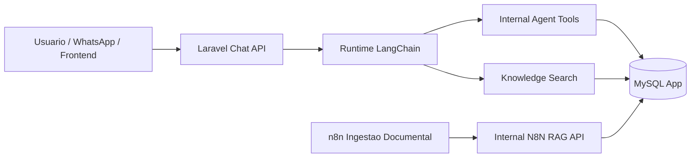

# Arquitetura do Chatbot: LangChain + MySQL + RAG Documental

Atualizado em 2026-03-19.

## Decisao arquitetural

Para o MedIntelligence, o LangChain deve consumir o banco da aplicacao e os endpoints internos do Laravel para dados operacionais.

Resumo pratico:

- MySQL da aplicacao e a fonte de verdade para clientes, faturas, titulos, despesas, cobrancas, dashboard e configuracoes.
- LangChain deve usar tools autenticadas do Laravel para consultar e executar acoes de negocio.
- RAG continua fazendo sentido para conhecimento nao estruturado, como manuais, FAQs, procedimentos internos, playbooks financeiros e regras operacionais.
- O vector database deixa de ser obrigatorio nesta fase. Os documentos RAG passam a ser ingeridos em MySQL nas tabelas `rag_documents` e `rag_chunks`.
- Se no futuro houver necessidade de busca semantica de maior escala, um vector store pode ser reintroduzido como cache de recuperacao, nunca como fonte primaria dos dados transacionais.

## Por que MySQL faz mais sentido para o runtime

Porque o chatbot precisa:

- consultar estado atual do negocio;
- executar criacao de cliente, conta a receber e conta a pagar;
- respeitar autorizacao por usuario;
- exigir confirmacao para operacoes sensiveis;
- responder com dados consistentes com o sistema operacional.

Esses requisitos dependem de:

- leitura transacional;
- regras de dominio;
- trilha de auditoria;
- contratos de API estaveis.

Vector database nao resolve isso. Ele serve para recuperar contexto textual, nao para substituir o modelo transacional.

## Arquitetura alvo

Implementacao desta iteracao:

- runtime Python em `agent-runtime/`;
- `FastAPI` para os endpoints de runtime;
- `LangChain` para planejamento de acao e agente de leitura;
- confirmacao de escrita via `POST /chat/resume`;
- `docker-compose.yml` atualizado com o servico `langchain-runtime`.

## Contratos internos implementados

### Autenticacao do runtime

Header obrigatorio:

- `X-Agent-Secret`
- `X-Agent-User-Id`

Middleware:

- `agent.runtime`

Rotas internas:

- `POST /api/internal/agent/session-context`
- `POST /api/internal/agent/knowledge/search`
- `GET /api/internal/agent/financial-summary`
- `POST /api/internal/agent/clientes/search`
- `POST /api/internal/agent/titulos/search`
- `POST /api/internal/agent/despesas/search`
- `POST /api/internal/agent/clientes`
- `POST /api/internal/agent/contas-receber`
- `POST /api/internal/agent/contas-pagar`

Busca complementar para resolucao de entidades:

- `POST /api/internal/agent/fornecedores/search`

### Autenticacao da ingestao n8n

Header obrigatorio:

- `X-N8N-Secret`

Middleware:

- `n8n.ingest`

Rotas internas:

- `POST /api/internal/n8n/rag/upsert`
- `POST /api/internal/n8n/rag/delete`

## Como o runtime LangChain deve operar

Fluxo recomendado:

1. Receber a mensagem do usuario.
2. Carregar contexto curto da sessao via `session-context`.
3. Identificar intencao:
   - consulta transacional;
   - consulta documental;
   - acao de criacao;
   - acao sensivel sujeita a confirmacao.
4. Chamar tools do Laravel.
5. Quando a pergunta depender de politica, FAQ ou procedimento, chamar `knowledge/search`.
6. Responder em formato estruturado para o frontend.

Fluxo implementado agora:

1. Laravel envia a mensagem para `POST /chat` ou `POST /chat/file`.
2. O runtime consulta `session-context` no Laravel.
3. Um planner estruturado decide se a mensagem e:
   - consulta;
   - busca documental;
   - preparacao de `criar_cliente`;
   - preparacao de `criar_conta_pagar`;
   - preparacao de `criar_conta_receber`.
4. Se for acao de escrita, o runtime devolve preview com `runtime_pending_action_id`.
5. O frontend confirma em `/api/chat/confirmar`.
6. O `ChatController` delega a aprovacao ao runtime em `POST /chat/resume`.
7. O runtime executa a criacao via tools internas do Laravel.

## Acoes ja preparadas no backend

Camada `app/Actions` disponivel para reutilizacao pelo runtime:

- `CriarClienteAction`
- `CriarTituloAction`
- `CriarDespesaAction`
- `CriarFaturaManualAction`
- `BaixarTituloAction`
- `UpsertRagDocumentAction`
- `DeleteRagDocumentAction`
- `SearchRagChunksAction`

## Como o novo desenho responde aos 6 upgrades do n8n

### 1. Autenticar o webhook

Resolvido com `X-N8N-Secret` e middleware `AuthenticateN8nIngestionRequest`.

### 2. Padronizar resposta para Laravel

Resolvido com `N8nRagController`, que retorna sempre:

- `success`
- `message`
- `data`

### 3. Enriquecer metadata dos documentos

Contrato de ingestao suporta:

- `business_context`
- `context_key`
- `checksum`
- `external_updated_at`
- `metadata`
- `chunks[].metadata`

### 4. Tratar update sem apagar antes de validar reindexacao

Resolvido em `UpsertRagDocumentAction`:

- a nova versao e gravada primeiro;
- so depois os chunks antigos sao desativados;
- se falhar, a versao anterior continua ativa.

### 5. Tratar delete de arquivo

Resolvido com `DeleteRagDocumentAction` e rota `POST /api/internal/n8n/rag/delete`.

### 6. Separar ou filtrar indice por contexto de negocio

Resolvido com:

- `business_context`
- `context_key`
- filtro em `SearchRagChunksAction`

## Workflow n8n gerado nesta iteracao

Arquivo base:

- `docs/n8n-medintelligence-rag-ingest-mysql.json`

Objetivo do workflow:

- manter o Google Drive como origem da ingestao;
- enviar documentos para o Laravel em vez de gravar direto em PGVector;
- suportar create, update e delete;
- enviar metadata padronizada;
- preparar a separacao por contexto de negocio.

## Recomendacao para a proxima fase

Endurecer e ampliar o runtime Python ja criado:

- subir o servico `agent-runtime` no ambiente real;
- plugar fornecedores, servicos e OS como novas tools;
- adicionar observabilidade de traces e auditoria por tool call;
- evoluir confirmacao para edicao humana de payload antes da execucao;
- adicionar testes do runtime com dependencias Python instaladas.
