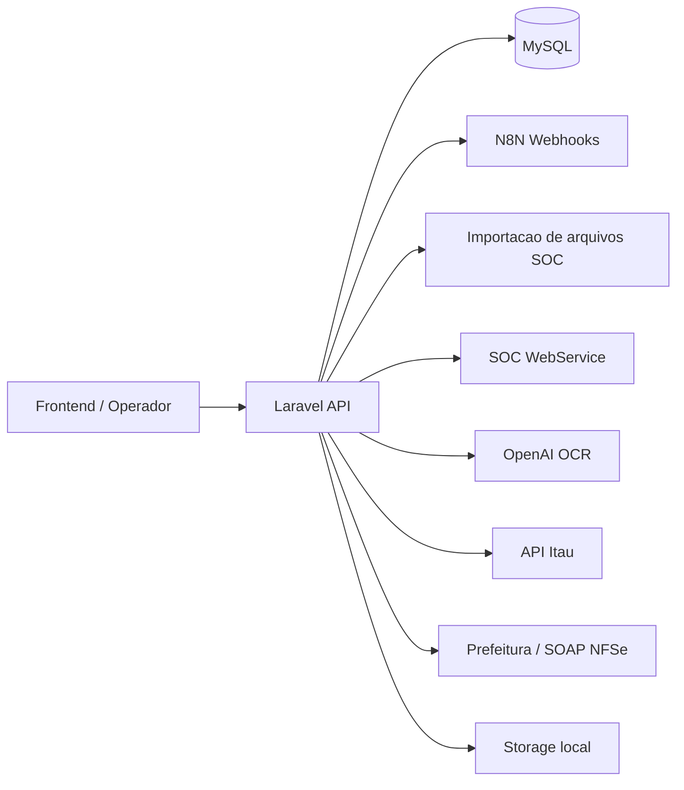
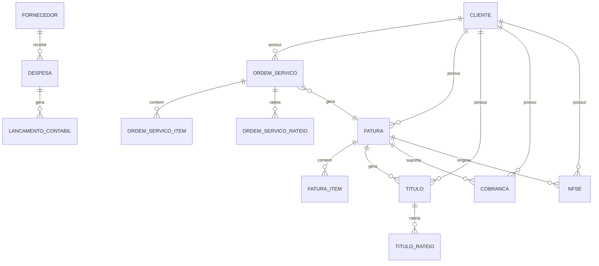

# Documentacao Tecnica do Backend MedIntelligence

Gerado em 2026-03-19 a partir do estado atual do repositorio `clinica-backend`.

Atualizacao da iteracao seguinte:

- a primeira rodada de hardening da Fase 0 ja foi aplicada;
- as rotas publicas de manutencao foram removidas de `routes/api.php`;
- `db-test` ficou restrita a ambiente local;
- o roteamento caiu de 141 para 126 rotas apos limpeza de contratos fantasmas e correcoes basicas.
- a suite de testes voltou a executar em PHPUnit com bootstrap funcional para Laravel;
- foram adicionadas factories e testes para os fluxos principais de `Fatura` e `Titulo`;
- os contratos de `Fatura` e `Titulo` foram alinhados com o schema real, incluindo `descricao` em `titulos`;
- `users` agora possui `role` e `ativo` persistidos em banco, removendo os valores sinteticos do modulo de configuracoes;
- `CobrancaController` passou a registrar cobrancas por `titulo_id`, com `valor_cobrado`, e o retorno bancario reutiliza a mesma regra de baixa do contas a receber;
- a primeira extracao da camada de aplicacao ja existe em `app/Actions/Financeiro` com `CriarFaturaManualAction` e `BaixarTituloAction`;
- o backend agora expoe rotas internas autenticadas para o runtime do agente e para ingestao RAG via n8n;
- o RAG documental passou a ter estrutura propria em MySQL com `rag_documents` e `rag_chunks`;
- `ChatController` foi alinhado com um gateway de runtime para LangChain/N8N em vez de depender de um contrato quebrado;
- `despesas` recebeu alinhamento adicional de schema com `valor_original` e `plano_conta_id`;
- persistem warnings deprecados sob PHP 8.5 em `vendor/laravel/framework` e Collision.

## 1. Escopo

Esta documentacao cobre o backend Laravel responsavel pelo dominio financeiro do MedIntelligence para clinicas SST. O foco desta analise foi:

- entender a arquitetura real do codigo;
- mapear modulos, entidades, rotas e integracoes;
- registrar fluxos de negocio centrais;
- identificar lacunas tecnicas antes da evolucao do chatbot;
- avaliar a prontidao da base para uma futura implementacao com LangChain.

O documento descreve o estado atual do codigo, nao um estado ideal.

## 2. Resumo Executivo

O backend ja cobre um escopo funcional grande: cadastro, faturamento, NFSe, contas a receber, contas a pagar, cobrancas, contabilidade, dashboard, relatorios, integracao com SOC/N8N e um modulo inicial de chat.

Ao mesmo tempo, a base esta em um estado heterogeneo:

- parte dos modulos funciona como CRUD consolidado;
- parte dos fluxos esta em prototipo ou mock;
- ha divergencias entre rotas, controllers, models e migrations;
- existem riscos severos de seguranca e manutencao;
- a malha de testes voltou a executar, mas ainda precisa limpeza de warnings e ampliacao de cobertura.

Conclusao pratica: o sistema tem base de dominio suficiente para evoluir para um assistente operacional, mas precisa primeiro de estabilizacao tecnica e consolidacao de contratos antes de introduzir LangChain de forma segura.

## 3. Panorama Estrutural

| Item | Quantidade observada |
|---|---:|
| Controllers PHP | 22 |
| Models | 19 |
| Services | 11 |
| Migrations | 31 |
| Arquivos de teste | 9 |
| Rotas listadas via `php artisan route:list` na baseline inicial | 141 |
| Rotas apos primeira mitigacao da Fase 0 | 126 |

### Stack atual

- PHP 8.2+ no projeto, com sinais de execucao local em PHP 8.5 por causa de warnings deprecados.
- Laravel 12 em `composer.json`.
- Laravel Sanctum para autenticacao por token.
- MySQL como banco principal.
- Vite/Tailwind no front asset pipeline do projeto Laravel.
- Maatwebsite Excel para importacoes.
- Guzzle/Http facade para integracoes externas.
- DOMPDF para exportacao PDF.
- xmlseclibs para assinatura XML.

### Divergencias de documentacao

- `README.md` ainda fala em Laravel 11, enquanto o projeto declara Laravel 12.
- `README.md` e `ANALISE_BACKEND.md` nao refletem a arquitetura atual.
- o projeto usa Sanctum, nao JWT.

## 4. Arquitetura Atual

### 4.1 Visao de alto nivel

### 4.2 Organizacao do codigo

- `app/Http/Controllers/Api`: concentracao da maior parte da logica.
- `app/Actions`: inicio da camada de aplicacao para fluxos financeiros centrais.
- `app/Models`: entidades Eloquent do dominio financeiro.
- `app/Services`: integracoes e regras de negocio especificas.
- `database/migrations`: schema evolutivo, com varias migrations corretivas e duplicadas.
- `routes/api.php`: definicao da API publica, protegida e interna para agente/n8n.

### 4.3 Padrao arquitetural predominante

O backend segue um estilo "controller-centric":

- controllers acumulam validacao, regra de negocio, persistencia e integracao externa;
- services existem, mas ainda nao formam uma camada de aplicacao coesa;
- a extracao de actions comecou nos fluxos de criacao manual de fatura e baixa de titulo;
- o backend ja possui uma primeira superficie de tools HTTP internas para um runtime LangChain separado;
- o dominio financeiro esta razoavelmente modelado, mas sem separacao clara entre application layer, integration layer e domain layer;
- o modulo de chat passou a aceitar um gateway de runtime, mas ainda precisa migrar totalmente da heuristica procedural para uma orquestracao orientada a tools.

## 5. Modulos de Negocio

### 5.1 Autenticacao

- Controller principal: `app/Http/Controllers/Api/AuthController.php`
- Mecanismo: Sanctum com token opaco salvo em banco.
- Fluxos presentes:
  - login;
  - logout;
  - `me`.

Observacao importante:

- as rotas publicas quebradas de `register` e `forgot-password` ja foram removidas na mitigacao inicial;
- o login agora considera o perfil persistido do usuario (`role`) e bloqueia usuarios inativos (`ativo = false`).

### 5.2 Cadastros

Controllers:

- `ClienteController`
- `ServicoController`
- `PlanoContaController`
- `CentroCustoController`
- `FornecedorController`

Responsabilidades:

- clientes SST;
- servicos faturaveis;
- plano de contas;
- centros de custo;
- fornecedores para contas a pagar.

Observacao:

- os CRUDs sao funcionais no nivel basico, mas varios controllers usam validacoes inline e nao usam `FormRequest` de forma consistente.

### 5.3 Ordens de Servico

Controller:

- `app/Http/Controllers/Api/OrdemServicoController.php`

Models:

- `OrdemServico`
- `OrdemServicoItem`
- `OrdemServicoRateio`

Fluxos:

- criacao manual de OS;
- importacao de planilha SOC;
- faturamento de OS para gerar fatura;
- armazenamento de rateio por centro de custo.

### 5.4 Faturamento

Controller principal:

- `app/Http/Controllers/Api/FaturaController.php`

Service principal:

- `app/Services/FaturamentoService.php`

Models:

- `Fatura`
- `FaturaItem`
- `Titulo`

Fluxos:

- criacao manual de fatura com itens;
- criacao em lote;
- importacao via SOC;
- geracao automatica de titulo financeiro;
- emissao local de NFSe em modo fallback;
- geracao de boleto ainda em mock.

### 5.5 NFSe

Controller:

- `app/Http/Controllers/Api/NfseController.php`

Integracao:

- `app/Services/Fiscal/NfseDiretaService.php`

Capacidades atuais:

- CRUD de NFSe local;
- emissao em lote com protocolo local;
- download de XML/PDF se disponiveis;
- cancelamento local;
- servico separado para emissao SOAP com certificado digital.

Estado real:

- ha estrutura para emissao real, mas o fluxo principal usado hoje ainda e majoritariamente local/mock.

### 5.6 Contas a Receber

Controller:

- `app/Http/Controllers/Api/TituloController.php`

Capacidades:

- listagem com filtros;
- criacao de titulos pagar/receber;
- rateio;
- baixa de pagamento;
- relatorio de aging;
- registro de boleto via Itau.

### 5.7 Cobrancas

Controller:

- `app/Http/Controllers/Api/CobrancaController.php`

Capacidades pretendidas:

- listar inadimplentes;
- enviar cobranca por WhatsApp via N8N;
- enviar cobranca por email via N8N;
- envio em lote;
- geracao de remessa CNAB;
- processamento de retorno bancario.

Estado real:

- o modulo esta funcional como ideia de fluxo, mas apresenta inconsistencias de schema e implementacao.

### 5.8 Contas a Pagar

Controller:

- `app/Http/Controllers/Api/DespesaController.php`

Model:

- `Despesa`

Capacidades:

- cadastro de despesas;
- classificacao contabil basica;
- geracao de lancamento contabil inicial;
- tentativa de analise automatica de documento por OCR/LLM;
- marcacao de pagamento.

### 5.9 Contabilidade

Controllers:

- `app/Http/Controllers/Api/Contabilidade/LancamentoContabilController.php`
- `app/Http/Controllers/Api/LancamentoContabilController.php`

Services:

- `app/Services/ContabilidadeService.php`
- `app/Services/ContabilidadeInteligenteService.php`

Capacidades:

- livro razao;
- balancete;
- exportacao OFX/CSV;
- sugestao de auditoria IA por score;
- criacao manual de lancamentos;
- classificacao automatica experimental via regras aprendidas.

Estado real:

- existe valor funcional, mas ha sobreposicao de controllers e divergencia de nomes de colunas.

### 5.10 Dashboard e Relatorios

Controllers:

- `DashboardController`
- `RelatorioController`

Capacidades:

- KPIs financeiros;
- fluxo de caixa;
- top clientes;
- receita por servico;
- taxa de inadimplencia;
- relatorios por periodo.

Estado real:

- parte das rotas apontam para metodos que nao existem.

### 5.11 Chat e Automacao

Controller:

- `app/Http/Controllers/Api/ChatController.php`

Model:

- `ChatMessage`

Fluxo atual:

1. usuario autenticado envia mensagem ou arquivo;
2. mensagem e salva em `chat_messages`;
3. consultas simples sao respondidas localmente;
4. demais requests seguem para webhook N8N;
5. resposta estruturada volta do N8N;
6. o front pode pedir confirmacao de acao;
7. o backend processa importacao de clientes ou geracao de OS.

Ponto forte:

- ja existe conceito de human-in-the-loop por meio de `/api/chat/confirmar`.

Ponto fraco:

- o controller concentra parsing, heuristica, persistencia, IO externo e importacao em um unico arquivo de 1200+ linhas.

## 6. Modelo de Dados Principal

### 6.1 Entidades centrais

| Entidade | Papel no dominio | Relacoes principais |
|---|---|---|
| `Cliente` | empresa/cliente atendido pela clinica | tem muitas `Fatura`, `Titulo`, `Cobranca`, `OrdemServico` |
| `Servico` | item comercial/fiscal faturavel | participa de `FaturaItem` |
| `OrdemServico` | consolidacao operacional de servicos executados | pertence a `Cliente`, gera `Fatura`, possui itens e rateios |
| `Fatura` | cabecalho financeiro/fiscal de cobranca | pertence a `Cliente`, possui `FaturaItem`, `Titulo`, `Cobranca`, `Nfse` |
| `Titulo` | conta a receber ou a pagar | pertence a `Cliente` ou `Fornecedor`, pode estar vinculado a `Fatura` |
| `Nfse` | nota fiscal de servico eletronica | pertence a `Fatura` e `Cliente` |
| `Despesa` | conta a pagar em modulo de despesas | pertence a `Fornecedor`, pode gerar `LancamentoContabil` |
| `PlanoConta` | classificacao contabil | base para `Titulo`, `Rateio` e `LancamentoContabil` |
| `CentroCusto` | classificacao gerencial | usado em OS, titulos e contabilidade |
| `LancamentoContabil` | partida contabil | referencia plano de contas, centro de custo, despesa e titulo |
| `ChatMessage` | historico de interacao do assistente | pertence a `User` |

### 6.2 Fluxo relacional dominante

## 7. Fluxos de Negocio Relevantes

### 7.1 SOC -> Ordem de Servico -> Fatura -> Titulo

1. operador importa arquivo SOC.
2. `SocImportService` cria OS, itens e rateios.
3. `FaturamentoService` transforma OS em fatura.
4. o backend gera titulo automaticamente.
5. a cobranca e a NFSe podem ser disparadas depois.

### 7.2 Fatura manual -> calculo tributario -> titulo

1. usuario informa cliente, periodo e itens.
2. `TributoService` calcula retencoes.
3. `FaturaController` cria fatura.
4. titulo financeiro e criado automaticamente.

### 7.3 Chat/N8N -> confirmacao -> importacao

1. usuario envia mensagem ou arquivo.
2. `ChatController` envia payload ao N8N.
3. N8N devolve `dados_estruturados`.
4. front exibe preview.
5. usuario confirma.
6. backend importa clientes ou gera ordens de servico.

### 7.4 Despesa -> classificacao contabil

1. usuario cadastra despesa.
2. controller cria despesa.
3. se houver plano/rateio, gera `LancamentoContabil`.
4. pagamento posterior marca a baixa.

## 8. Superficie de API

Principais grupos observados em `routes/api.php`:

| Grupo | Objetivo |
|---|---|
| `/api/auth` | login e contexto do usuario |
| `/api/dashboard` | KPIs e visoes consolidadas |
| `/api/ordens-servico` | operacao e faturamento de OS |
| `/api/cadastros/*` | clientes, servicos, planos de conta, centros de custo |
| `/api/fornecedores` | fornecedores |
| `/api/faturamento/*` | faturas, itens, importacoes, NFSe local |
| `/api/nfse/*` | hub fiscal |
| `/api/titulos` e `/api/contas-receber/*` | contas a receber/pagar |
| `/api/contas-pagar/*` | despesas |
| `/api/contabilidade/*` | livro razao e IA contabil |
| `/api/cobrancas/*` | recuperacao de recebiveis |
| `/api/relatorios/*` | consultas gerenciais |
| `/api/configuracoes/*` | empresa, usuarios e integracoes |
| `/api/chat/*` | assistente operacional |
| `/api/n8n/*` | integracoes auxiliares para automacao |

Observacao critica:

- o mesmo arquivo tambem expoe rotas publicas de manutencao e alteracao de banco, o que nao deve existir em ambiente produtivo.

## 9. Integracoes Externas

### 9.1 N8N

Usos atuais:

- chat conversacional;
- envio de cobrancas;
- automacao externa.

Dependencias esperadas em ambiente:

- `N8N_WEBHOOK_URL`
- `N8N_WEBHOOK_CHAT_URL`
- `N8N_COBRANCA_WHATSAPP_WEBHOOK`
- `N8N_COBRANCA_EMAIL_WEBHOOK`

Problema:

- essas variaveis nao aparecem em `config/services.php` nem em `.env.example`.

### 9.2 SOC

Dois modos observados:

- importacao por arquivo CSV/TXT via `SocImportService`;
- sincronizacao por webservice via `SocIntegrationService`.

### 9.3 OpenAI

Uso observado:

- OCR/interpretacao de documentos em `DocumentReaderService`.

Problemas:

- `config('services.openai.key')` e usado, mas `config/services.php` nao define `openai`.
- o servico usa `chat/completions` diretamente com modelo `gpt-4o`.
- a injecao em `DespesaController` esta desalinhada com namespace/import.

### 9.4 Prefeitura / NFSe

- integracao via SOAP com certificado digital.
- assinatura XML com `xmlseclibs`.
- configuracao parcial via tabela `configuracoes` e `env`.

### 9.5 Itau

- integracao para registro de boleto.
- uso de mTLS com CRT/KEY locais no storage.
- ha estrutura de autenticacao OAuth.

## 10. Deploy, Ambiente e Operacao

### 10.1 Docker

Arquivos:

- `Dockerfile`
- `docker-compose.yml`

Achado relevante:

- o Dockerfile expone Apache na porta `80`;
- o `docker-compose.yml` mapeia `8000:8000`;
- isso indica divergencia de porta e potencial erro de subida.

### 10.2 Ambiente

`.env` atual observado:

- `APP_ENV=production`
- `APP_DEBUG=false`
- conexao MySQL local

Risco:

- ha sinais de uso local com configuracao de producao e rotas publicas de manutencao expostas na API.

### 10.3 Scripts auxiliares

O repositorio contem varios scripts shell de correcao e setup:

- `fix-everything.sh`
- `clean-database.sh`
- `create-*`
- `setup-*`

Isso sugere historico de ajustes manuais frequentes e schema ainda pouco estabilizado.

## 11. Testes e Qualidade

### 11.1 Estado atual dos testes

O comando `php artisan test` executa com sucesso no estado atual analisado.

Cobertura minima ja existente:

- autenticacao com `role` e `ativo`;
- criacao de usuario pelo modulo de configuracoes;
- criacao manual de fatura;
- geracao automatica de titulo a partir da fatura;
- criacao direta de titulo;
- baixa de titulo;
- envio de cobranca com registro por titulo.

Conclusao:

- a suite ja protege os fluxos mais criticos que estavam quebrando nas iteracoes anteriores;
- ainda falta ampliar cobertura para OS, importacoes SOC, NFSe e chat.

### 11.2 Warnings tecnicos

Durante `php artisan route:list` e `php artisan test` surgiram warnings deprecados relacionados a:

- `PDO::MYSQL_ATTR_SSL_CA` em PHP 8.5;
- `ReflectionMethod::setAccessible()` no Collision/PHPUnit.

## 12. Achados Criticos e Divida Tecnica

### 12.1 Criticos

- na baseline inicial, `routes/api.php` expunha endpoints publicos de manutencao e alteracao de schema; isso ja foi removido nesta iteracao de hardening;
- ha rotas mapeadas para metodos inexistentes, por exemplo:
  - `AuthController@register`
  - `AuthController@forgotPassword`
  - `ClienteController@importarLote`
  - `ClienteController@sincronizarSoc`
  - `ClienteController@analisarImportacao`
  - `ChatController@historico`
  - `ChatController@limparHistorico`
  - `N8nController@webhook`
  - `RelatorioController@getFluxoCaixaReal`
  - `RelatorioController@getDREReal`
  - `RelatorioController@exportarPDF`
  - `Contabilidade\LancamentoContabilController@dreReal`
  - `Contabilidade\LancamentoContabilController@processarTitulo`
  - `FaturaController@update`
- o modulo de testes nao executa.

Parte dessas rotas ja foi removida ou corrigida na primeira mitigacao da Fase 0, mas a lista foi mantida aqui como registro do estado encontrado na analise original.

### 12.2 Altos

- `DespesaController` depende de `CategoriaDespesa` sem model correspondente.
- `DespesaController` usa `DocumentReaderService` com namespace/import incompatibilizados.
- `DashboardController` conta clientes ativos por coluna `ativo`, mas o cadastro de clientes usa `status`.
- `FaturamentoService` usa `iss_retido` no cliente, enquanto o schema do cliente usa `reter_iss`.
- `ContabilidadeService` e `ContabilidadeInteligenteService` usam namespace `App\Services\Financeiro`, enquanto os arquivos estao em `app/Services`.

### 12.3 Medios

- ha 3 migrations para `chat_messages`.
- ha documentacao antiga e contraditoria no repositorio.
- seeders usam campos desatualizados como `categoria`, `status` e `unidade` em `servicos`.
- controllers grandes concentram muita responsabilidade.
- variaveis de ambiente essenciais para integracoes nao estao documentadas.

## 13. Avaliacao de Prontidao para Chatbot e LangChain

### 13.1 O que ja ajuda

- o dominio financeiro esta modelado;
- ha API relativamente ampla;
- ha historico de chat persistido;
- ja existe confirmacao explicita de acoes;
- ha integracoes com N8N e OCR;
- os principais workflows ja existem no backend.

### 13.2 O que ainda impede uma boa base de agentes

- contratos HTTP e internos instaveis;
- falta de camada clara de actions/tools de negocio;
- ausencia de testes executaveis;
- endpoints quebrados e campos inconsistentes;
- baixa observabilidade e pouca idempotencia;
- risco de seguranca alto.

### 13.3 Diretriz tecnica

Nao e recomendavel conectar LangChain diretamente aos controllers atuais.

O caminho correto e:

1. estabilizar schema, contratos e seguranca;
2. extrair acoes de negocio para services/actions reutilizaveis;
3. padronizar entrada/saida dessas acoes;
4. so entao expor essas acoes como tools para um agente.

Tambem nao e recomendavel tentar implementar LangChain dentro do proprio codigo PHP como primeira opcao. A abordagem mais segura e madura para este projeto e:

- manter o Laravel como system of record e camada transacional;
- criar um servico dedicado de orquestracao IA em Python;
- usar LangChain ou, preferencialmente, LangGraph nesse servico;
- expor tools que chamem actions do backend via HTTP interno, fila ou RPC simples.

Isso reduz acoplamento, facilita observabilidade e aproveita o ecossistema mais maduro de agentes em Python.

## 14. Candidatos Naturais a Tools/Funcoes

Quando a base estiver estabilizada, as primeiras funcoes candidatas para o chatbot sao:

- consultar cliente por CNPJ ou nome;
- listar titulos em aberto, vencidos e a vencer;
- gerar OS a partir de dados estruturados;
- gerar fatura de uma OS;
- baixar titulo;
- registrar boleto;
- listar KPIs do dashboard;
- consultar fluxo de caixa;
- analisar documento de despesa;
- aprovar ou revisar lancamento contabil sugerido;
- emitir cobranca por canal;
- consultar status de NFSe.

## 15. Recomendacao Final

O backend tem massa critica suficiente para sustentar um assistente operacional orientado a acoes. O melhor caminho, porem, nao e "plugar LangChain" agora, e sim preparar a base para isso.

Prioridade real:

1. remover riscos de seguranca;
2. corrigir contratos quebrados;
3. estabilizar schema e testes;
4. extrair uma camada de actions;
5. so depois implementar LangChain sobre contratos confiaveis.
