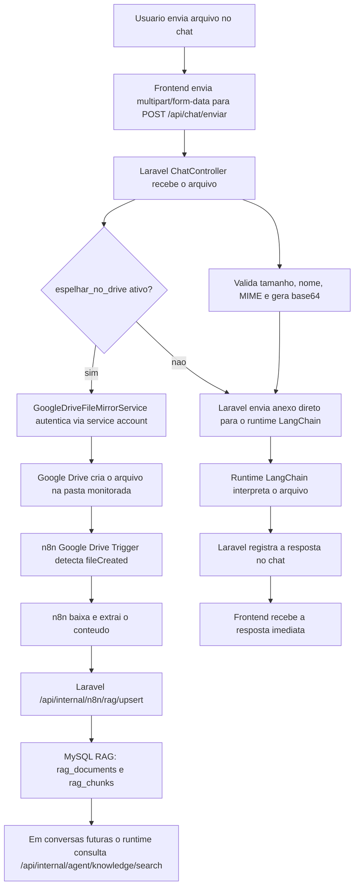

# Fluxo de Upload do Chat para Google Drive, n8n e Chatbot

Este documento descreve, no detalhe, o fluxo completo do arquivo quando o usuario envia um anexo para processamento e o sistema tambem espelha esse arquivo para ingestao assincrona via Google Drive e n8n.

## Visao geral

Existem dois caminhos em paralelo quando o chat recebe um arquivo:

1. caminho sincrono: responder o usuario imediatamente
2. caminho assincrono: enviar uma copia para o Google Drive, deixar o n8n indexar no RAG e reaproveitar esse conhecimento depois

## Diagrama de execucao



## Responsabilidades por etapa

### 1. Frontend

Responsavel por:

- montar `multipart/form-data`
- enviar `mensagem`
- enviar `arquivo`
- opcionalmente enviar `espelhar_no_drive=true`
- opcionalmente enviar `drive_required=true`

Payload esperado:

- `mensagem`: texto da solicitacao
- `arquivo`: anexo real
- `tipo_processamento`: `auto`, `clientes`, `servicos` ou `financeiro`
- `session_id`: identificador da sessao
- `espelhar_no_drive`: se deve enviar copia ao Google Drive
- `drive_required`: se falha no espelhamento deve bloquear a requisicao

### 2. Laravel `POST /api/chat/enviar`

Arquivo principal:

- [ChatController.php](/Users/papalino/workspace/medintelligence/clinica-backend/app/Http/Controllers/Api/ChatController.php)

Responsavel por:

- autenticar o usuario
- validar o arquivo
- limitar tamanho em `10MB`
- converter o binario para `base64`
- decidir se tambem vai espelhar o arquivo para o Google Drive
- enviar o payload para o runtime LangChain
- persistir mensagens em `chat_messages`

Detalhe:

- o fluxo do chat continua funcionando mesmo sem Google Drive
- o espelhamento para Drive e opcional
- se `drive_required=true`, qualquer erro no Drive interrompe a requisicao com `502`

### 3. Servico de espelhamento no Google Drive

Arquivo principal:

- [GoogleDriveFileMirrorService.php](/Users/papalino/workspace/medintelligence/clinica-backend/app/Services/GoogleDriveFileMirrorService.php)

Responsavel por:

- carregar credenciais da service account
- gerar JWT assinado
- trocar JWT por `access_token`
- criar o arquivo remoto no Google Drive
- enviar o conteudo binario do arquivo
- devolver metadata do arquivo criado

Variaveis usadas:

- `GOOGLE_DRIVE_SERVICE_ACCOUNT_JSON` ou `GOOGLE_DRIVE_SERVICE_ACCOUNT_PATH`
- `GOOGLE_DRIVE_FOLDER_ID`
- `GOOGLE_DRIVE_SCOPE`
- `GOOGLE_DRIVE_TOKEN_URL`
- `GOOGLE_DRIVE_FILES_URL`
- `GOOGLE_DRIVE_UPLOAD_BASE_URL`

Resultado retornado ao chat:

```json
{
  "success": true,
  "provider": "google_drive",
  "file_id": "drive-file-001",
  "file_name": "chat-upload_u10_sessao_1_20260319_103000_clientes.xlsx",
  "folder_id": "1GJiQDVdOJ8ljF4CS9kH6n7vKLrDzD_oi"
}
```

### 4. Google Drive

Responsavel por:

- armazenar o arquivo espelhado pelo backend
- emitir alteracao de pasta observada pelo n8n

Ponto importante:

- a service account precisa ter acesso de escrita na pasta monitorada

### 5. n8n

Workflow:

- [n8n-medintelligence-rag-ingest-mysql-producao-sem-env.json](/Users/papalino/workspace/medintelligence/clinica-backend/docs/n8n-medintelligence-rag-ingest-mysql-producao-sem-env.json)

Nos principais:

- `Arquivo Novo`: escuta `fileCreated`
- `Arquivo Atualizado`: escuta `fileUpdated`
- `Arquivo Excluido`: escuta `fileDeleted`
- `Normalizar Documento`: padroniza metadata
- `Download File`: baixa o binario real
- `Tipo Arquivo`: decide o extrator
- `Extrair XLSX`: le planilhas
- `Extrair PDF`: le PDFs
- `Extrair Texto`: le textos simples
- `Laravel Upsert XLSX/PDF/Texto`: envia chunks para o Laravel
- `Laravel Delete`: remove documento do indice logico

Responsavel por:

- detectar mudanca no Drive
- baixar o arquivo
- extrair conteudo
- chamar os endpoints internos do Laravel protegidos por `X-N8N-Secret`

### 6. Laravel RAG ingest

Arquivo principal:

- [N8nRagController.php](/Users/papalino/workspace/medintelligence/clinica-backend/app/Http/Controllers/Api/N8nRagController.php)

Rotas:

- `POST /api/internal/n8n/rag/upsert`
- `POST /api/internal/n8n/rag/delete`

Responsavel por:

- validar o payload do n8n
- criar ou atualizar `rag_documents`
- criar ou atualizar `rag_chunks`
- manter versoes anteriores inativas sem apagar antes
- processar delete logico

### 7. Runtime LangChain

Arquivos principais:

- [main.py](/Users/papalino/workspace/medintelligence/clinica-backend/agent-runtime/app/main.py)
- [service.py](/Users/papalino/workspace/medintelligence/clinica-backend/agent-runtime/app/service.py)
- [file_parser.py](/Users/papalino/workspace/medintelligence/clinica-backend/agent-runtime/app/file_parser.py)

Responsavel por:

- responder imediatamente sobre o anexo enviado no chat
- manter memoria curta de sessao
- usar tools do Laravel para consultar MySQL
- consultar o RAG em conversas futuras
- pedir confirmacao antes de criar registros

## Linha do tempo real de execucao

### Parte A: resposta imediata ao usuario

1. usuario envia `clientes.xlsx`
2. frontend chama `POST /api/chat/enviar`
3. `ChatController` valida o anexo
4. `ChatController` converte para `base64`
5. `ChatController` envia o arquivo para o runtime LangChain
6. `file_parser.py` tenta ler a planilha
7. o runtime responde com analise, preview ou acao sugerida
8. o Laravel devolve a resposta para a tela

### Parte B: indexacao assincrona para reaproveitamento posterior

1. o mesmo `ChatController` chama `GoogleDriveFileMirrorService`
2. o backend envia uma copia para a pasta do Drive
3. o n8n detecta o novo arquivo
4. o n8n baixa o arquivo do Drive
5. o n8n extrai o conteudo
6. o n8n chama `/api/internal/n8n/rag/upsert`
7. o Laravel grava `rag_documents` e `rag_chunks`
8. em perguntas futuras, o runtime consulta `knowledge/search`

## O que volta para o sistema em cada fase

### Resposta imediata do chat

Volta para o frontend:

- `content`
- `dados_estruturados`
- `acao_sugerida`
- `arquivo_ingestao`

Campo novo:

- `arquivo_ingestao`: mostra se o espelhamento no Google Drive foi tentado, se deu certo e qual `file_id` foi criado

### Resposta assincrona do n8n

Nao volta diretamente para a tela do usuario.

O resultado fica persistido em:

- `rag_documents`
- `rag_chunks`

O beneficio aparece depois, quando o chatbot consulta esse conhecimento.

## Quando cada componente falha

### Falha no Laravel antes do runtime

Sintoma:

- `422` ou `500` no `/api/chat/enviar`

Responsavel:

- validacao de arquivo
- erro interno do controller

### Falha no Google Drive

Sintoma:

- `arquivo_ingestao.success = false`
- ou `502` se `drive_required=true`

Responsavel:

- credencial service account
- pasta sem permissao
- `GOOGLE_DRIVE_FOLDER_ID` errado

### Falha no n8n

Sintoma:

- arquivo existe no Drive, mas nao aparece no RAG

Responsavel:

- workflow desativado
- credencial Google do n8n
- `X-N8N-Secret`
- URL do backend

### Falha no runtime

Sintoma:

- chat sem resposta
- `Falha de conexão com IA`

Responsavel:

- runtime Python fora do ar
- `CHATBOT_RUNTIME_URL` incorreta
- `CHATBOT_RUNTIME_SECRET` divergente

## Configuracao recomendada

No Laravel:

```env
CHATBOT_CHAT_UPLOAD_MIRROR_TO_DRIVE=true
CHATBOT_CHAT_UPLOAD_MIRROR_TO_DRIVE_REQUIRED=false
CHATBOT_CHAT_UPLOAD_DRIVE_NAME_PREFIX=chat-upload

GOOGLE_DRIVE_SERVICE_ACCOUNT_PATH=/caminho/credentials.json
GOOGLE_DRIVE_FOLDER_ID=1GJiQDVdOJ8ljF4CS9kH6n7vKLrDzD_oi
GOOGLE_DRIVE_SCOPE=https://www.googleapis.com/auth/drive
```

## Como testar manualmente

1. enviar um arquivo pelo chat com `espelhar_no_drive=true`
2. verificar no JSON da resposta se `arquivo_ingestao.success = true`
3. confirmar no Google Drive se o arquivo apareceu
4. confirmar no n8n se o trigger rodou
5. confirmar no MySQL se surgiram registros em `rag_documents` e `rag_chunks`
6. fazer uma pergunta ao chatbot sobre o documento depois da ingestao
